```mermaid
flowchart LR
    U[User / Client] -->|REST API| API[FastAPI Backend]

    API -->|Create Task| DB[(PostgreSQL)]
    API -->|Read WorkflowConfig| DB

    %% Daemon
    D[Task Poller]
    W[Workflow Executor]

    DB -->|Queued Tasks| D
    D --> W

    %% Workflow Nodes (declared first)
    I[Ingestion]
    P[Parsing - Docling]
    E[Extraction - LLM]
    S[Summarization - LLM]

    W --> I
    I --> P
    P --> E
    E --> S

    %% LLM Layer
    LC[LangChain Client]
    LLMs[LLM Providers]

    E --> LC
    S --> LC
    LC --> LLMs

    S --> DB
    DB --> API
    API --> U

    %% Grouping (visual only)
    subgraph Worker["Daemon"]
        D
        W
    end

    subgraph Workflow["Dynamic Workflow Pipeline"]
        I
        P
        E
        S
    end

    subgraph LLM["LLM Orchestration"]
        LC
        LLMs
    end

```

# 📄 Extracto — LLM-Powered Document Intelligence Platform

> 🚧 **Work in Progress**  
> Extracto is under active development. APIs, workflows, and internal architecture may evolve as the system matures.

**Extracto** is a production-grade document intelligence platform that transforms unstructured documents into **structured data and high-quality summaries** using **Large Language Models (LLMs)**.

It is designed to showcase **real-world AI engineering**—combining scalable backend systems, deterministic orchestration, and provider-agnostic LLM integration for enterprise document workflows.

---

## 🎯 Problem Statement

Organizations process massive volumes of documents (PDFs, DOCX, text, scanned files), but face challenges such as:

- Layout-aware parsing failures
- Brittle rule-based extraction systems
- Non-deterministic and costly LLM usage
- Poor observability and recovery in async pipelines

**Extracto solves this by providing a workflow-driven, observable, and production-safe document processing platform.**

---

## ✨ Core Capabilities

### 🧠 LLM-Driven Structured Extraction
- Entity and field extraction using schema-guided prompts
- Relationship inference across document sections
- Works across invoices, resumes, reports, and contracts

### 📝 Intelligent Summarization
- Multi-level summaries (short / detailed / domain-specific)
- Prompt-controlled depth and focus
- Deterministic retries and failure isolation

### 📋 Multi-Format Document Support
- PDF, DOCX, TXT
- Layout-aware parsing using **Docling**
- Normalized document representation before LLM invocation

### ⚙️ Workflow-Based Processing
- Stage-driven execution:
  - **Ingestion**
  - **Parsing**
  - **Extraction**
  - **Summarization**
- Dynamically configurable via `WorkflowConfig`
- Step-level status tracking and fault recovery

### 🔐 Secure & Scalable APIs
- Authenticated REST APIs
- Rate-limited, schema-validated requests
- Designed for both UI and programmatic consumption

### 📊 Observability & Analytics
- Per-stage execution metrics
- Processing latency and failure tracking
- Structured logs for auditability

---

## 🏗️ High-Level Architecture

Extracto follows a **microservice-oriented, async processing architecture**.

### Backend Service
- **Tech Stack**: Python, FastAPI
- **Responsibilities**:
  - Task creation and validation
  - Workflow resolution
  - API exposure for frontend and clients

### Daemon (Worker Engine)
- Long-running background process
- Polls task queue from PostgreSQL
- Executes workflow stages sequentially
- Updates task state and metadata

### LLM Layer
- Built using **LangChain**
- Provider-agnostic (OpenAI, Anthropic, local models)
- Centralized prompt and retry management

### Database
- **PostgreSQL**
  - Users, Projects, Documents
  - Tasks with stage-level status tracking
  - Workflow definitions

---

## 🏗️ System Architecture



---

## 🗂️ Task Execution Model

Each task maintains a **global status** and **stage-level metadata**:

```json
{
  "status": "In Progress",
  "metadata": [
    {
      "method": "PARSING",
      "status": "Success",
      "started_at": "...",
      "completed_at": "...",
      "error": null
    }
  ]
}
```

This enables:

- Partial retries at individual workflow stages
- Precise failure diagnosis with stage-level error context
- Real-time progress updates for long-running document pipelines

---

## 🛠️ Tech Stack

| Layer | Technology |
|------|-----------|
| API Layer | FastAPI |
| Background Processing | Python Daemon (poll-based worker) |
| LLM Orchestration | LangChain |
| Document Parsing | Docling |
| Database | PostgreSQL |
| Authentication | JWT |
| Observability | Structured logs, metrics |

---

## 🚀 Local Development Setup

### Prerequisites
- Python 3.9+
- PostgreSQL
- Git

## 🤝 Contributing

Extracto is a personal engineering and research project by **Sarthak Bhatkar**.  
While primarily built to demonstrate production-grade AI system design, constructive contributions are welcome.

You can contribute by:
- Reporting bugs or architectural issues
- Proposing workflow or LLM orchestration improvements
- Suggesting optimizations for parsing, extraction, or summarization
- Improving documentation and examples

Please open an issue before submitting major changes to discuss design alignment.

---

## 📜 License

This project is licensed under the **MIT License**.  
See the `LICENSE` file for full details.

---

## 📞 Contact

- **GitHub**: https://github.com/sarthakbhatkar1  
- **Email**: sarthakbhatkarofficial@gmail.com  
- **LinkedIn**: https://www.linkedin.com/in/sarthakbhatkar  

---

_Built by Sarthak Bhatkar — AI Engineer focused on LLM systems, scalable backends, and production-grade AI platforms._
